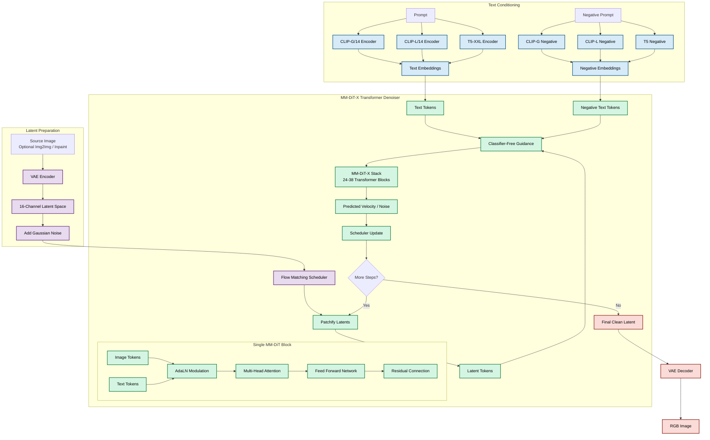

# SD3.5 / Flux-Style Generation Flow

```mermaid
flowchart TD

%% =====================================================
%% INPUTS
%% =====================================================

A[Prompt]
B[Negative Prompt]
C[Source Image<br/>Optional Img2Img / Inpaint]

%% =====================================================
%% TEXT ENCODERS
%% =====================================================

subgraph TEXT["Text Conditioning"]

A --> D1[CLIP-G/14 Encoder]
A --> D2[CLIP-L/14 Encoder]
A --> D3[T5-XXL Encoder]

B --> E1[CLIP-G Negative]
B --> E2[CLIP-L Negative]
B --> E3[T5 Negative]

D1 --> F[Text Embeddings]
D2 --> F
D3 --> F

E1 --> G[Negative Embeddings]
E2 --> G
E3 --> G

end

%% =====================================================
%% LATENT PREPARATION
%% =====================================================

subgraph LATENT["Latent Preparation"]

C --> H[VAE Encoder]

H --> I[16-Channel Latent Space]

I --> J[Add Gaussian Noise]

end

%% =====================================================
%% SCHEDULER
%% =====================================================

K[Flow Matching Scheduler]

J --> K

%% =====================================================
%% MM-DIT DENOISING
%% =====================================================

subgraph DENOISE["MM-DiT-X Transformer Denoiser"]

K --> L[Patchify Latents]

L --> M[Latent Tokens]

F --> N[Text Tokens]
G --> O[Negative Text Tokens]

M --> P
N --> P
O --> P

P[Classifier-Free Guidance]

P --> Q[MM-DiT-X Stack<br/>24-38 Transformer Blocks]

subgraph BLOCK["Single MM-DiT Block"]

R[Image Tokens]

S[Text Tokens]

R --> T[AdaLN Modulation]
S --> T

T --> U[Multi-Head Attention]

U --> V[Feed Forward Network]

V --> W[Residual Connection]

end

Q --> X[Predicted Velocity / Noise]

X --> Y[Scheduler Update]

Y --> Z{More Steps?}

Z -- Yes --> L

Z -- No --> AA[Final Clean Latent]

end

%% =====================================================
%% DECODER
%% =====================================================

AA --> AB[VAE Decoder]

AB --> AC[RGB Image]

%% =====================================================
%% STYLING
%% =====================================================

classDef text fill:#D6EAF8,color:#000000,stroke:#1F618D,stroke-width:2px
classDef latent fill:#E8DAEF,color:#000000,stroke:#6C3483,stroke-width:2px
classDef dit fill:#D5F5E3,color:#000000,stroke:#1E8449,stroke-width:2px
classDef block fill:#FCF3CF,color:#000000,stroke:#B7950B,stroke-width:2px
classDef output fill:#FADBD8,color:#000000,stroke:#922B21,stroke-width:2px

class D1,D2,D3,E1,E2,E3,F,G text
class H,I,J,K latent
class L,M,N,O,P,Q,R,S,T,U,V,W,X,Y dit
class AC,AB,AA output
```
