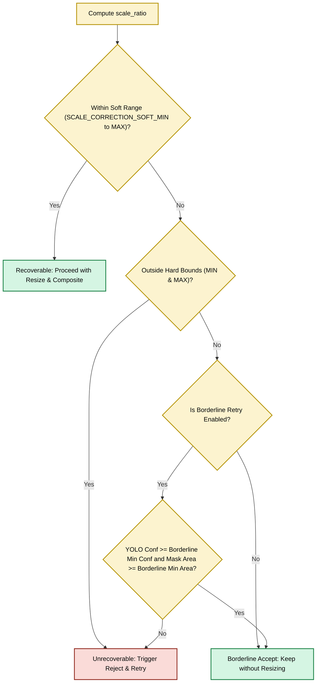

# Pedestrian Augmentation & Scale Correction Pipeline

This document explains and visualizes the complete end-to-end pedestrian augmentation pipeline implemented in [sd3.5-agumentation-scale-correction-clean.ipynb](file:///d:/VIN/vinsmartfuture/Project/notebooks/sd3.5-agumentation-scale-correction-clean.ipynb).

---

## 1. End-to-End Pipeline Flow

Below is the workflow showing how a street scene image is augmented with realistic pedestrians, validated, and optimized.

```mermaid
flowchart TD

%% =====================================================
%% INPUTS & SCANNING
%% =====================================================
subgraph INPUT["1. Input & Scanning"]
    A[Dataset Split / Images] --> B[Dataset Scanner]
    B --> C[Select Target Insertion BBox]
end

%% =====================================================
%% GENERATION PIPELINE
%% =====================================================
subgraph GEN["2. Generation & Segmentation"]
    C --> D[Crop Local Context Area]
    D --> E[Prepare Context Crop And Optional Mask]
    E --> F[Stable Diffusion 3.5 Context Generation]
    F --> G[YOLOv8m-seg Person Detection]
end

%% =====================================================
%% SCALE CORRECTION
%% =====================================================
subgraph SCALE["3. Scale Correction Policy"]
    G --> H["Compute Disparity from Depth Map (LiheYoung/depth-anything-small-hf)"]
    H --> I[Calculate Expected Height]
    I --> J[Enforce Monotonic Perspective Heights]
    J --> K["Compute scale_ratio (expected_height / detected_height)"]
    K --> L{Scale Policy Check}
end

%% =====================================================
%% POST-PROCESSING & COMPOSITING
%% =====================================================
subgraph COMP["4. Post-Processing & Blending"]
    L -- Recoverable --> M["Resize Person Crop & Mask"]
    M --> N["Mask Fringe Trim, Edge Feathering & Morphological Cleanup"]
    N --> O[Add Contact Shadow]
    O --> P[Alpha Paste + Local Background Edge Match]
end

%% =====================================================
%% VALIDATION & RETRY
%% =====================================================
subgraph VALID["5. Validation & Manifest"]
    P --> Q[YOLO Final Composite Validation]
    Q --> R{"Does Person Pass YOLO & Geometry Check?"}
    R -- No / Failed --> S{"Retry Count < Max?"}
    S -- Yes --> E
    S -- No --> T[Log Rejection / Skip]
    R -- Yes / Passed --> U[Save Augmented Image & Manifest]
    U --> V[Quality-Guided Autotune Report]
end

L -- Unrecoverable --> S

%% =====================================================
%% STYLING
%% =====================================================
classDef input fill:#D6EAF8,color:#000000,stroke:#1F618D,stroke-width:2px
classDef gen fill:#E8DAEF,color:#000000,stroke:#6C3483,stroke-width:2px
classDef scale fill:#FCF3CF,color:#000000,stroke:#B7950B,stroke-width:2px
classDef comp fill:#D5F5E3,color:#000000,stroke:#1E8449,stroke-width:2px
classDef valid fill:#FADBD8,color:#000000,stroke:#922B21,stroke-width:2px

class A,B,C input
class D,E,F,G gen
class H,I,J,K,L scale
class M,N,O,P comp
class Q,R,S,T,U,V valid

```

---

## 2. Scale Correction Policy Sub-Flow

The scale-correction mechanism evaluates whether the generated pedestrian conforms to the perspective geometry of the scene based on depth estimations.

---

## 3. Core Functions & Roles

*   **`expected_person_height_from_depth`**: Retrieves disparity values from `LiheYoung/depth-anything-small-hf` at the foot coordinates, maps it linearly to a height ratio `[0.075, 0.29]`, and adjusts it with variant-specific multipliers (e.g., `distant` vs `near` scaling).
*   **`enforce_monotonic_perspective_heights`**: Sorts insertion targets by depth coordinates (`foot_y`) and guarantees that pedestrians physically closer to the camera have expected heights equal to or greater than those further back.
*   **`scale_correction_policy`**: Decides whether to scale, accept, or reject/retry based on `scale_ratio` thresholds.
*   **`corrected_person_layers`**: Orchestrates the extraction of YOLO crops, scales them by the computed `scale_ratio`, applies morphological cleaning and boundary checks, and overlays the resized layers back onto the scene context.
*   **`validate_pasted_person_mask`**: Executes final validation on composite image to check for mask transparency, invalid aspect ratios, and extreme border collisions.
*   **`prepare_person_paste_mask`**: Cleans the YOLO person mask, keeps accessory components, trims a 1px generated-background fringe, and softly feathers the paste boundary.
*   **`blended_background_mean_map`**: Matches pasted edges against background pixels in a tight local band around the inserted person, including horizontal-row mean matching inside the local paste context only.
