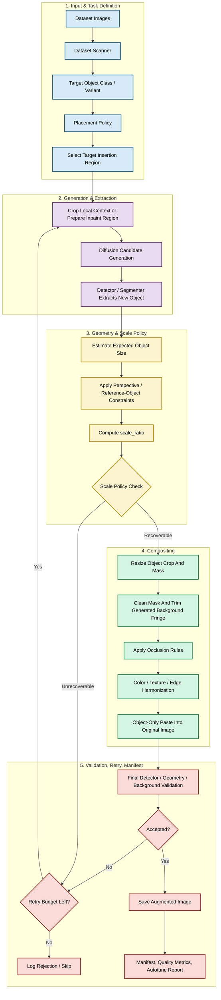
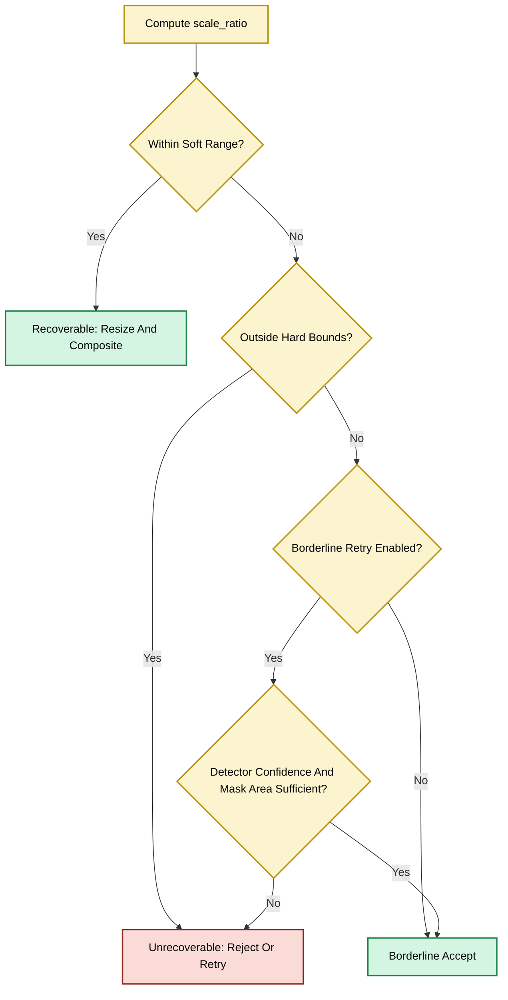

# Background-Preserving Object Insertion Workflow

This document explains the end-to-end workflow for a data augmentation pipeline that adds target objects to images while preserving the original background.

The current implementation is demonstrated on CityPersons pedestrian insertion in [sd3.5-agumentation-scale-correction-clean.ipynb](file:///d:/VIN/vinsmartfuture/Project/notebooks/sd3.5-agumentation-scale-correction-clean.ipynb), but the workflow is intended to generalize to other datasets and object classes.

---

## 1. End-to-End Pipeline Flow

---

## 2. What Must Stay General

The architecture should not assume CityPersons as the only dataset. A new dataset should be able to replace:

- scanner and label parser;
- target object classes;
- prompt templates;
- placement policy;
- detector/segmenter;
- scale policy;
- validation thresholds;
- output manifest schema.

The current names still use `person` in many functions because pedestrians are the reference object class. Conceptually, those parts map to `target_object`.

---

## 3. Scale Correction Policy

The scale-correction mechanism evaluates whether the generated object conforms to expected geometry.

For pedestrians, expected height is derived from depth/ground position and validated through foot anchoring. For other objects, the anchor and expected dimension should change.

---

## 4. Current Reference Functions

- **`find_insertion_region`**: proposes a valid insertion region using object-specific placement rules. Current implementation focuses on pedestrian placement in road/sidewalk scenes.
- **`expected_person_height_from_depth`**: reference height prior for pedestrians. For other objects, replace this with object-specific expected size logic.
- **`scale_correction_policy`**: decides whether a detected object can be resized, accepted, or rejected.
- **`corrected_person_layers`**: extracts detected object crops, resizes them with masks, and rebuilds corrected layers. This is conceptually `corrected_object_layers`.
- **`prepare_person_paste_mask`**: cleans the segmentation mask, keeps useful components, trims generated-background fringe, and feathers the paste boundary.
- **`paste_crop_person_to_original`**: pastes only the accepted object pixels back into the original image crop. This is the core background-preservation step.
- **`harmonize_pedestrian_edge`**: applies boundary-only edge cleanup without destroying the object core.
- **`validate_composite_result`**: checks object mask quality, final difference, geometry, and metadata before accepting the sample.

---

## 5. Adapting To A New Object Class

To move from pedestrians to another object class, do the adaptation in this order:

1. Define target object classes and prompt variants.
2. Add or replace detector/segmenter support for those classes.
3. Define valid placement regions and forbidden regions.
4. Define expected size and anchor logic.
5. Define occluder classes and depth rules.
6. Tune mask cleanup and edge harmonization for the object shape.
7. Update quality metrics and manifest fields.
8. Run smoke batches, inspect rejection reasons, then tune thresholds.

CityPersons remains a useful benchmark because it stresses scale, grounding, occlusion, and detector validation, but the repo documentation should be read as an object-insertion augmentation framework.
